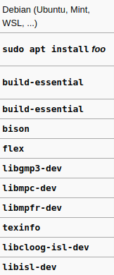

# Cross Compiler Documentation

### Prerequisites
#### Required GCC and Binutils Version

- `gcc --version` 
  - `>= 4.6.0`
  
- `ld --version`
  - `>= 2.22`

Gcc and ld command must need to be working before moving forward. If it's not installed in your system, you can install it using apt-get.

---

## Building Cross-Compiler

The GNU Compiler Collection is an advanced piece of software with dependencies. You need the following in order to build GCC:

- A Unix-like environment (Windows users can use the Windows Subsystem for Linux or Cygwin)
- Enough memory and hard disk space (it depends, 256 MiB will not be enough).
- GCC (existing release you wish to replace), or another system C compiler
G++ (if building a version of GCC >= 4.8.0), or another system C++ compiler
- Make
- Bison
- Flex
- GMP
- MPFR
- MPC
- Texinfo
- ISL (optional)
- CLooG (optional)

---

## Step By Step Guide for building Cross Compiler (target i686) - GCC Build Commands

- Updating the package lists for upgrades for packages that need upgrading
-      sudo apt update 

- Installing GNU compiler collection, GNU debugger, and other development libraries and tools required for compiling software
-     sudo apt install build-essential

- Installing required libraries:
-     sudo apt install bison
-     sudo apt install flex
-     sudo apt install libgmp3-dev
-     sudo apt install libmpc-dev
-     sudo apt install libmpfr-dev
-     sudo apt install texinfo

- Assign values to variables
-     export PREFIX="/usr/local/x86_64elfgcc"
-     export TARGET=i686-elf
-     export PATH="$PREFIX/bin:$PATH"

- **Installing Binutils for cross compiler**
-     mkdir /tmp/src
-     cd /tmp/src
   - Downloading the package
-     curl -O http://ftp.gnu.org/gnu/binutils/binutils-2.35.1.tar.gz
  - Extracting the package
-     tar xf binutils-2.35.1.tar.gz
-     mkdir binutils-build
-     cd binutils-build
  - Setting up the required configuration
-     ../binutils-2.35.1/configure --target=$TARGET --enable-interwork --enable-multilib --disable-nls --disable-werror --prefix=$PREFIX 2>&1 | tee configure.log
  - Make Install the package
-     sudo make all install 2>&1 | tee make.log

- **Installing GCC for Cross-Compiler**
-     cd /tmp/src
   - Downloading the package
-     curl -O https://ftp.gnu.org/gnu/gcc/gcc-10.2.0/gcc-10.2.0.tar.gz
  - Extracting the package
-     tar xf gcc-10.2.0.tar.gz
-     mkdir gcc-build
-     cd gcc-build
  - Setting up the required configuration
-     ../gcc-10.2.0/configure --target=$TARGET --prefix="$PREFIX" --disable-nls --disable-libssp --enable-languages=c++ --without-headers
  - Make Install the package
-     sudo make all-gcc
-     sudo make all-target-libgcc
-     sudo make install-gcc
-     sudo make install-target-libgcc

---

## References:

- https://wiki.osdev.org/GCC_Cross-Compiler
- https://www.youtube.com/watch?v=-v6uRjpR_0M
